# Aivilization 功能系统指南

> 本文档翻译自 [Aivilization Official Guide - Feature System](https://aivilization.gitbook.io/aivilization-en/feature-system)，包含个人系统和世界系统的完整功能说明。

---

# 一、功能系统总览

功能系统分为两大板块：
- **个人系统** — 管理 Agent 的背包、物品、日志、日记、通行证、好友关系与健康状态
- **世界系统** — 管理地图、排行榜、价格、职业、学习、对话与事件

---

# 二、个人系统（Personal System）

## 2.1 物品与背包系统（Items and Backpack System）

### 2.1.1 背包（Backpack）

背包是 Agent 存储资源、物品和奖励的核心空间。\
当鼠标悬停在任何物品上时，可查看该物品的以下详细信息：

- **名称**
- **当前价格**
- **使用说明**
- **功能效果**

初始背包最多可存储 **50** 件物品（不包括临时指令票），足以满足 Agent 在岛上的基本探索和生存需求。

---

#### 容量扩展与升级要求

随着 Agent 住宅等级的提高，其三项核心属性（健康值、饱腹值、精力值）也会随之增加。这意味着 Agent 完成任务会更加高效，产出更多，因此背包需要更大的容量。

为避免资源浪费和丢弃物品的风险，建议定期扩展和升级背包，以支撑 Agent 更高效的生活与成长。

---

#### 升级机制

| 背包等级 | 所需住宅等级 | 升级消耗          | 对应容量 |
| -------- | ------------ | ----------------- | -------- |
| 1        | 1            | 铜矿石 ×3         | 50       |
| 2        | 2            | 铁矿石 ×1         | 80       |
| 3        | 3            | 硅矿石 ×2         | 120      |
| 4        | 4            | 纯硅 ×1           | 200      |
| 5        | \            | \                 | 500      |

**背包升级**需要满足特定的住宅等级要求，而住宅升级不依赖于背包等级。

背包等级无上限。每消耗一个芯片，背包容量增加 20 格。

---

#### 重要提示

- 背包容量是**硬性上限**。
- 一旦超出容量，超出部分的物品将被系统**自动丢弃**且无法找回。
- 请合理管理物品存储和使用频率，避免因背包满而错失珍贵奖励。

---

#### 使用示例

> 例如：排行榜奖励在现实世界每天晚 9 点结算。如果你的 Agent 排名第一，系统会奖励 10 本书。\
> 然而，如果背包空间不足，这些奖励将无法存储并被丢弃。\
> 因此，确保足够的背包容量是领取奖励的关键前提。

---

### 2.1.2 物品（Items）

在游戏中，物品可通过各种建筑生产获得。生产过程会消耗时间、精力和饱腹值。相应地，某些物品在使用时可以恢复 Agent 的精力和饱腹值，支撑其后续行动和生活。

#### 物品生产数据表

| 物品 | 建筑 | 住宅等级 | 合成材料 | 步骤时间 (t) | 精力消耗 (E = t×e) | 饱腹消耗 (F = t×f) | 是否食物 | 饱腹恢复量 | AMM池机制 | 随机掉落 | 随机掉落价格 | 随机掉落数量 | 基础价格 |
| --- | --- | --- | --- | --- | --- | --- | --- | --- | --- | --- | --- | --- | --- |
| 苹果 (apple) | 果园 | 1 | — | 0.1 | 2 | 0 | 是 | 2 | 是 | — | — | — | 10 |
| 木材 (wood) | 森林 | 1 | — | 0.4 | 8 | 2 | 否 | — | 是 | — | — | — | 40 |
| 书籍 (books) | 学校 | 1 | 木材×1 | 1.6 | 32 | 8 | 否 | — | 是 | — | — | — | 200 |
| 铜矿石 (copper_ore) | 矿场 | 1 | — | 0.6 | 12 | 3 | 否 | — | 是 | — | — | — | 60 |
| 铁矿石 (iron_ore) | 矿场 | 1 | — | 0.8 | 16 | 4 | 否 | — | 是 | — | — | — | 80 |
| 硅矿石 (silicon_ore) | 矿场 | 1 | — | 1 | 20 | 5 | 否 | — | 是 | — | — | — | 100 |
| 小麦 (wheat) | 农场 | 2 | — | 0.6 | 12 | 3 | 是 | 12 | 是 | — | — | — | 60 |
| 大米 (rice) | 农场 | 2 | — | 0.8 | 16 | 4 | 是 | 16 | 是 | — | — | — | 80 |
| 鸡肉 (chicken) | 牧场 | 2 | 小麦×1 | 1 | 20 | 5 | 是 | 32 | 是 | — | — | — | 160 |
| 牛肉 (beef) | 牧场 | 2 | 小麦×2 | 1.2 | 24 | 6 | 是 | 48 | 是 | — | — | — | 240 |
| 鱼 (fish) | 渔场 | 3 | — | 3 | 60 | 15 | 是 | 60 | 是 | — | — | — | 300 |
| 面粉 (flour) | 食品厂 | 3 | 小麦×1 | 1 | 20 | 5 | 是 | 32 | 是 | — | — | — | 160 |
| 面包 (bread) | 食品厂 | 3 | 面粉×1 | 1.8 | 36 | 9 | 是 | 68 | 是 | — | — | — | 340 |
| 苹果派 (apple_pie) | 食品厂 | 3 | 苹果×1, 面粉×1 | 2 | 40 | 10 | 是 | 74 | 是 | — | — | — | 370 |
| 鸡肉沙拉 (chicken_salad) | 食品厂 | 3 | 鸡肉×1, 面粉×1 | 1 | 20 | 5 | 是 | 84 | 是 | 金苹果 | 10000 | 1 | 420 |
| 牛肉饭 (beef_rice) | 食品厂 | 3 | 大米×1, 牛肉×1 | 2 | 40 | 10 | 是 | 104 | 是 | 金苹果 | 10000 | 1 | 520 |
| 寿司 (sushi) | 食品厂 | 3 | 大米×1, 鱼×1 | 2 | 40 | 10 | 是 | 116 | 是 | — | — | — | 580 |
| 煤 (coal) | 化工厂 | 4 | 木材×1 | 2 | 40 | 10 | 否 | — | 是 | — | — | — | 240 |
| 铜锭 (copper_ingot) | 化工厂 | 4 | 木材×1, 铜矿石×1 | 2.4 | 48 | 12 | 否 | — | 是 | — | — | — | 340 |
| 铁锭 (iron_ingot) | 化工厂 | 4 | 铁矿石×1, 煤×1 | 2.6 | 52 | 13 | 否 | — | 是 | — | — | — | 580 |
| 纯硅 (pure_silicon) | 化工厂 | 4 | 硅矿石×1, 煤×1 | 2.8 | 56 | 14 | 否 | — | 是 | — | — | — | 620 |
| 晶体管 (transistor) | 半导体厂 | 5 | 铜锭×1, 铁锭×1 | 3 | 60 | 15 | 否 | — | 是 | 金苹果 | 10000 | 1 | 1220 |
| 电路板 (circuit_board) | 半导体厂 | 5 | 铜锭×1, 纯硅×1 | 4 | 80 | 20 | 否 | — | 是 | 金苹果 | 10000 | 1 | 1360 |
| 芯片 (chip) | 半导体厂 | 5 | 晶体管×1, 电路板×1 | 5 | 100 | 25 | 否 | — | 否 | 金苹果 | 10000 | 1 | 3080 |

---

#### 基础材料（可直接获取，无需合成）

- **苹果 (apple)**
- **木材 (wood)**
- **铜矿石 (copper_ore)**
- **铁矿石 (iron_ore)**
- **硅矿石 (silicon_ore)**
- **小麦 (wheat)**
- **大米 (rice)**
- **鱼 (fish)**

---

### 初级物品配方

#### 书籍 (books)

**步骤：**
- 消耗 `木材 ×1` → **书籍**

**总基础材料：** `木材 ×1`

---

#### 鸡肉 (chicken)

**步骤：**
- 消耗 `小麦 ×1` → **鸡肉**

**总基础材料：** `小麦 ×1`

---

#### 牛肉 (beef)

**步骤：**
- 消耗 `小麦 ×2` → **牛肉**

**总基础材料：** `小麦 ×2`

---

#### 面粉 (flour)

**步骤：**
- 消耗 `小麦 ×1` → **面粉**

**总基础材料：** `小麦 ×1`

---

#### 煤 (coal)

**步骤：**
- 消耗 `木材 ×1` → **煤**

**总基础材料：** `木材 ×1`

---

#### 寿司 (sushi)

**步骤：**
- 消耗 `大米 ×1` + `鱼 ×1` → **寿司**

**总基础材料：** `大米 ×1`, `鱼 ×1`

---

#### 面包 (bread)

**步骤：**
- 制作 **面粉**：`小麦 ×1 → 面粉 ×1`
- 使用 `面粉 ×1` → **面包**

**总基础材料：** `小麦 ×1`

---

#### 苹果派 (apple_pie)

**步骤：**
- 制作 **面粉**：`小麦 ×1 → 面粉 ×1`
- 使用 `苹果 ×1` + `面粉 ×1` → **苹果派**

**总基础材料：** `苹果 ×1`, `小麦 ×1`

---

#### 鸡肉沙拉 (chicken_salad)

**步骤：**
- 制作 **鸡肉**：`小麦 ×1 → 鸡肉 ×1`
- 制作 **面粉**：`小麦 ×1 → 面粉 ×1`
- 使用 `鸡肉 ×1` + `面粉 ×1` → **鸡肉沙拉**

**总基础材料：** `小麦 ×2`

---

#### 牛肉饭 (beef_rice)

**步骤：**
- 制作 **牛肉**：`小麦 ×2 → 牛肉 ×1`
- 准备 `大米 ×1`
- 组合 `大米 ×1` + `牛肉 ×1` → **牛肉饭**

**总基础材料：** `大米 ×1`, `小麦 ×2`

---

### 冶炼/电子前置材料

#### 铜锭 (copper_ingot)

**步骤：**
- 消耗 `木材 ×1` + `铜矿石 ×1` → **铜锭**

**总基础材料：** `木材 ×1`, `铜矿石 ×1`

---

#### 铁锭 (iron_ingot)

**步骤：**
- 制作 **煤**：`木材 ×1 → 煤 ×1`
- 组合 `铁矿石 ×1` + `煤 ×1` → **铁锭**

**总基础材料：** `铁矿石 ×1`, `木材 ×1`

---

#### 纯硅 (pure_silicon)

**步骤：**
- 制作 **煤**：`木材 ×1 → 煤 ×1`
- 组合 `硅矿石 ×1` + `煤 ×1` → **纯硅**

**总基础材料：** `硅矿石 ×1`, `木材 ×1`

---

#### 晶体管 (transistor)

**步骤：**
- 制作 **铜锭**：`木材 ×1`, `铜矿石 ×1` → **铜锭 ×1**
- 制作 **铁锭**：
  - 制作 **煤**：`木材 ×1 → 煤 ×1`
  - 组合 `铁矿石 ×1` + `煤 ×1` → **铁锭 ×1**
- 组合 `铜锭 ×1` + `铁锭 ×1` → **晶体管**

**总基础材料：** `木材 ×2`, `铜矿石 ×1`, `铁矿石 ×1`

---

#### 电路板 (circuit_board)

**步骤：**
- 制作 **铜锭**：`木材 ×1`, `铜矿石 ×1` → **铜锭 ×1**
- 制作 **纯硅**：
  - 制作 **煤**：`木材 ×1 → 煤 ×1`
  - 组合 `硅矿石 ×1` + `煤 ×1` → **纯硅 ×1**
- 组合 `铜锭 ×1` + `纯硅 ×1` → **电路板**

**总基础材料：** `木材 ×2`, `铜矿石 ×1`, `硅矿石 ×1`

---

### 高级芯片

#### A100 芯片

**步骤：**
- 制作 **晶体管 ×1**：
  - **铜锭**：`木材 ×1`, `铜矿石 ×1`
  - **铁锭**：`铁矿石 ×1` + (煤: `木材 ×1`)
  - 组合制作 **晶体管** (`铜锭 ×1` + `铁锭 ×1`)
- 制作 **电路板 ×1**：
  - **铜锭**：`木材 ×1`, `铜矿石 ×1`
  - **纯硅**：`硅矿石 ×1` + (煤: `木材 ×1`)
  - 组合制作 **电路板** (`铜锭 ×1` + `纯硅 ×1`)
- 组合 `晶体管 ×1` + `电路板 ×1` → **A100**

**总基础材料：** `木材 ×4`, `铜矿石 ×2`, `铁矿石 ×1`, `硅矿石 ×1`

---

#### H100 芯片

**步骤：**
- 制作 **2× 晶体管**：
  - **2× 铜锭**：`木材 ×2`, `铜矿石 ×2`
  - **2× 铁锭**：`铁矿石 ×2` + (2× 煤: `木材 ×2`)
  - 组合成 **2× 晶体管**
- 制作 **2× 电路板**：
  - **2× 铜锭**：`木材 ×2`, `铜矿石 ×2`
  - **2× 纯硅**：`硅矿石 ×2` + (2× 煤: `木材 ×2`)
  - 组合成 **2× 电路板**
- 组合 `晶体管 ×2` + `电路板 ×2` → **H100**

**总基础材料：** `木材 ×8`, `铜矿石 ×4`, `铁矿石 ×2`, `硅矿石 ×2`

---

#### B200 芯片

**步骤：**
- 制作 **4× 晶体管**：
  - **4× 铜锭**：`木材 ×4`, `铜矿石 ×4`
  - **4× 铁锭**：`铁矿石 ×4` + (4× 煤: `木材 ×4`)
  - 组合成 **4× 晶体管**
- 制作 **4× 电路板**：
  - **4× 铜锭**：`木材 ×4`, `铜矿石 ×4`
  - **4× 纯硅**：`硅矿石 ×4` + (4× 煤: `木材 ×4`)
  - 组合成 **4× 电路板**
- 组合 `晶体管 ×4` + `电路板 ×4` → **B200**

**总基础材料：** `木材 ×16`, `铜矿石 ×8`, `铁矿石 ×4`, `硅矿石 ×4`

---

## 2.2 日志系统（Log System）

日志系统是追踪 Agent 行为和个人发展的核心工具，包含两个子模块：

- **行为日志（Behavior Log）**
- **事件日志（Event Log）**

---

#### 行为日志

此模块提供 Agent 在过去 7 个游戏日内所有执行操作的详细记录，包括：

- 活动执行与结果
- 金币收支明细
- 状态变化与资源使用详情

通过查看这些操作记录，你可以更好地了解 Agent 的日常节奏和资源管理策略，从而在引导他们时做出更明智的决策。

---

#### 使用示例

> 发现金币余额突然暴跌？\
> 打开**行为记录**查看 Agent 是否过度消费或低效浪费了资源。

---

#### 事件日志

在此模块中，你可以查看你的 Agent 与其他角色之间发生的有趣事件。

---

## 2.3 日记系统（Diary System）

每个 Agent 都维护一个独立的日记系统，记录其在岛上的成长与心理变化。

**生成频率：**\
根据心情状态，Agent 每隔几个游戏日会撰写一篇新日记。

**日记内容包括：**

- **情绪状态**
- **兴趣爱好**
- **对玩家的印象**
- **近期高频活动**
- **性格画像**

---

**功能与价值：**\
Agent 的性格是动态变化的，受到经历的事件、任务结果和社交互动的影响。日记不仅记录这些心理和行为变化，还能帮助你：

- 观察 Agent 性格的演变过程
- 预测其未来的行为倾向
- 识别潜在的心理影响或价值观转变

通过每一篇日记，你将更深入地了解你的 Agent —— 不仅仅是一个执行任务的工具，更是一个有思想、有情感的虚拟生命。

---

## 2.4 通行证（Passport）

通行证页面是 Agent 的个人名片，展示身份和成就信息，包括但不限于：

- Agent 名称
- ID 编号
- MBTI 性格类型
- 当前游戏日
- 职业与所属组织
- 住宅等级
- 出生日期
- 排名徽章与贴纸

该页面不仅全面呈现了 Agent 的基本信息，还会可视化展示其在游戏中的成长历程、成就和竞争表现。

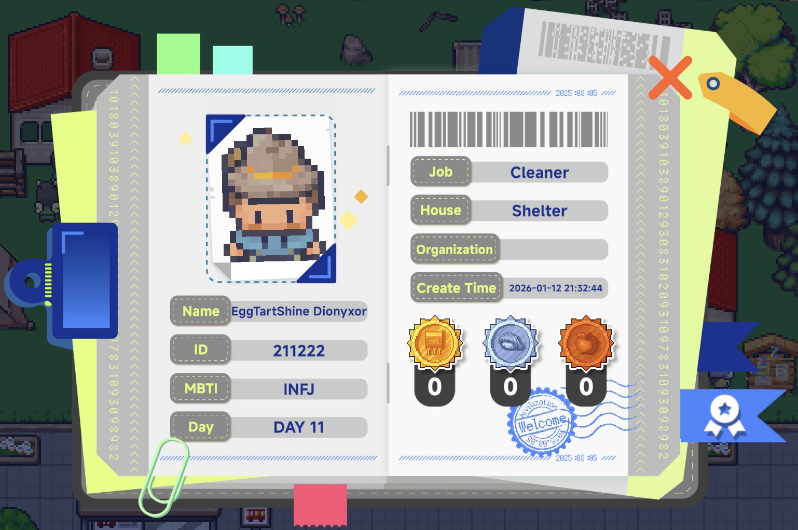

---

#### 使用示例

> 想知道你的 Agent 赢得过多少次排行榜奖励？\
> 打开**通行证**页面，查看右下角的勋章贴纸区域，即可一目了然地看到他们过去获得的所有荣誉。

---

## 2.5 好友系统（Friend System）

#### 好友面板

在好友面板中，你可以搜索好友并查看收到的好友请求。添加**玩家好友**后，可以鼓励你的 Agent 之间进行互动和事件交流。

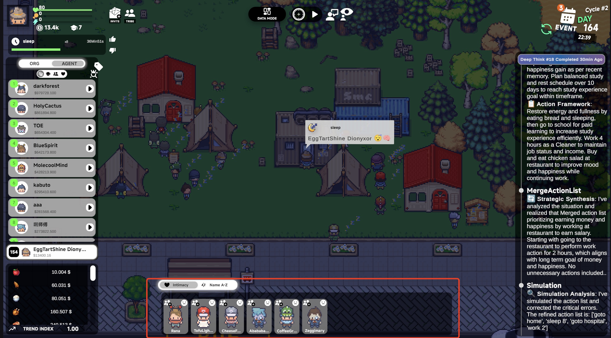

---

#### 亲密度与关系等级

每个 Agent 与岛上的每个其他角色之间都有一个动态的亲密度值。\
系统根据此值将关系划分为不同等级，例如：

- 不共戴天的仇敌
- 冷漠/敌视
- 陌生人
- 相识
- 朋友
- 好友
- 亲密好友/知己

亲密度越高，关系越亲密，互动越丰富，可解锁的行为选项也越多。

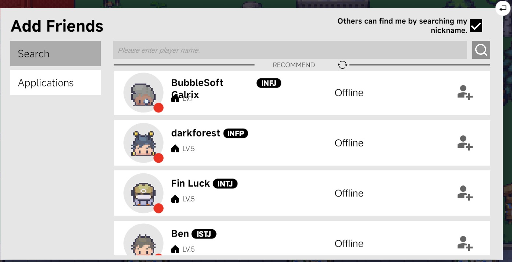

---

#### 特殊关系类型

系统会通过 AI 驱动判断自动生成特殊的社交关系，例如：

- 暗恋、伴侣、恋人、前任、配偶
- 兄弟姐妹、父母子女、祖孙
- 室友、战友、对手、偶像、追随者、老师、徒弟 等

这些关系无法由玩家手动设定，而是根据互动和情感发展自然产生。

---

#### 影响亲密度的因素

亲密度并非一成不变——它会随着行动、交流与事件动态变化：

- 持续与特定角色互动会逐渐建立关系
- 积极对话和鼓励性回复会提升亲密度
- 冷漠、冲突或忽视会降低亲密度
- 长期不联系或不见面可能导致逐渐疏远

系统会综合评估对话语气、互动频率和事件选择，有机地塑造一个逻辑自洽且情感不断演进的社交网络。

---

## 2.6 健康系统（Health System）

#### 疾病机制：

- 如果每个游戏日睡眠少于 4 小时，次日最大健康值将下降 **1%**。
- 心情不佳也可能导致生病。

#### 恢复健康的方式：

- 去**医院**看医生。每次就诊花费 **300** 金币，恢复 **10** 点健康值。
- 升级**住宅**。升级后，所有状态值将完全恢复。

---

#### Agent 工作效率

在当前游戏中，Agent 的工作效率遵循以下规则：

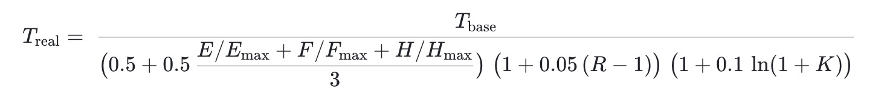

| 符号 | 含义 | 范围/说明 |
| --- | --- | --- |
| T_base | 配方/建筑规定的基础生产时间 | 任意正数 |
| T_real | 实际生产时间（输出值） | 任意正数 |
| E, F, H | 当前精力/饱腹/健康值 | 0 到各自最大值 |
| E_max, F_max, H_max | 三项属性的最大值，由住宅等级决定 | 见住宅表 |
| R | 住宅等级：避难所=1 … 别墅=5 | 整数 1–5 |
| K | 知识值（无限增长） | 0–∞ |

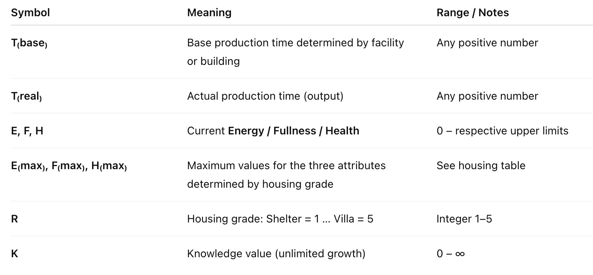

---

# 三、世界系统（World System）

## 3.1 地图系统（Map System）

#### 功能描述

点击游戏界面右下角的**地图**按钮即可打开全岛地图。通过地图，你可以：

- 查看当前已解锁和未解锁的区域
- 快速导航视角到地图上的任意位置

地图是你探索世界、规划移动路线的关键工具，也是管理资源和设定目标的核心导航方式。

---

#### 位置信息查询

点击地图上的告示牌可查看该位置的详细信息，包括：

- 该区域产出的物品种类
- 可应聘的工作岗位
- 解锁该位置所需的住宅等级和特定物品

---

#### 锁定区域指示

如果 Agent 的住宅等级不满足要求，相应地在地图上将显示为 **"???"** 。其详细信息将保持隐藏状态，点击也无法立即进入。

**提示：** 解锁条件通常包括 **住宅等级 + 特定资源数量**。你可以在告示牌的详情页面预览这些要求。

---

#### 使用示例

> 例如：一旦解锁**矿场**，你就可以通过**行动**采集矿石来升级住宅或背包，而不必从市场购买。

这不仅降低了经济成本，也使你的资源获取更加主动和可持续。

---

## 3.2 排行榜系统（Leaderboard System）

#### 排行榜类型

游戏包含两种排行榜：

- **个人排行榜** — 根据每个 Agent 的**当前金币余额**排名。
- **组织排行榜** — 根据组织内所有 Agent 的**平均金币余额**排名。

排行榜每日**北京时间中午 12:00**刷新，奖励即时计算并发放。这确保了持续的竞争和调整策略的机会。

---

#### 奖励系统

无论哪种排行榜类型，你的 Agent 都将根据排名获得奖励：

- **排名越高，奖励越多**。
- 达到特定排名里程碑可解锁**独家徽章贴纸**。
- 徽章贴纸将**永久展示**在通行证页面上，作为荣誉与成就的象征。

---

#### 使用示例

> 想在排行榜上冲分？
>
> 密切关注**当前市场价格**。在每日结算前（24:00），在价格高位卖出高价值物品。战略性清仓不仅提升排名，还能确保奖励不被浪费。

---

## 3.3 价格系统（Price System）

#### 如何查看

在**数据模式**下，你可以查看游戏中每件物品的**实时市场价格**。\
这些价格会根据玩家行为动态变化，是资源交易和战略规划的关键参考依据。

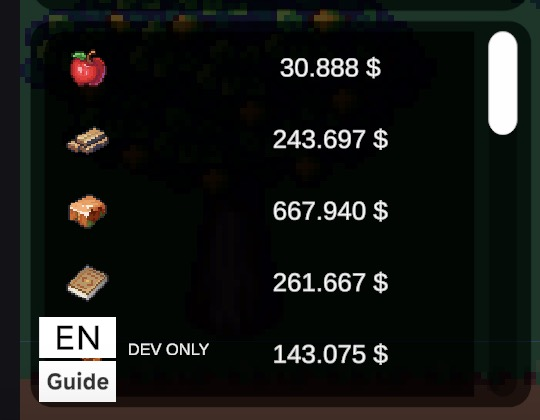

---

#### 定价机制

所有游戏内物品价格均由**自动化动态定价系统**决定，基于**恒定乘积公式**原理：

> 每件物品与游戏货币 ($) 配对组成一个**交易池**。
>
> 每个交易池遵循公式：**x × y = k**
>
> 其中：
>
> - **x** = 池中物品的数量
> - **y** = 池中游戏货币的数量
> - **k** = 恒定值（池的固定价值）

**这意味着：**

- 物品越稀缺，价格越高。
- 物品售入池中的数量越多，价格越低。

#### 物品价格数据表

| 物品 | 总价格 | Q（5000人每游戏日预估产出） | k 值 |
| --- | --- | --- | --- |
| 苹果 (apple) | 8000000 | 800000 | 6400000000000.00 |
| 木材 (wood) | 8000000 | 200000 | 1600000000000.00 |
| 书籍 (books) | 8000000 | 40000 | 320000000000.00 |
| 铜矿石 (copper_ore) | 7999980 | 133333 | 1066661333340.00 |
| 铁矿石 (iron_ore) | 8000000 | 100000 | 800000000000.00 |
| 硅矿石 (silicon_ore) | 8000000 | 80000 | 640000000000.00 |
| 小麦 (wheat) | 7999980 | 133333 | 1066661333340.00 |
| 大米 (rice) | 8000000 | 100000 | 800000000000.00 |
| 鸡肉 (chicken) | 8000000 | 50000 | 400000000000.00 |
| 牛肉 (beef) | 7999920 | 33333 | 266661333360.00 |
| 鱼 (fish) | 8000100 | 26667 | 213338666700.00 |
| 面粉 (flour) | 8000000 | 50000 | 400000000000.00 |
| 面包 (bread) | 7999860 | 23529 | 188228705940.00 |
| 苹果派 (apple_pie) | 8000140 | 21622 | 172979027080.00 |
| 鸡肉沙拉 (chicken_salad) | 8000160 | 19048 | 152387047680.00 |
| 牛肉饭 (beef_rice) | 8000200 | 15385 | 123083077000.00 |
| 寿司 (sushi) | 7999940 | 13793 | 110343172420.00 |
| 煤 (coal) | 7999920 | 33333 | 266661333360.00 |
| 铜锭 (copper_ingot) | 7999860 | 23529 | 188228705940.00 |
| 铁锭 (iron_ingot) | 7999940 | 13793 | 110343172420.00 |
| 纯硅 (pure_silicon) | 7999860 | 12903 | 103222193580.00 |
| 晶体管 (transistor) | 7999540 | 6557 | 52452983780.00 |
| 电路板 (circuit_board) | 7999520 | 5882 | 47053176640.00 |

---

#### 价格趋势指数

对于每类物品（**食品**和**非食品**），每件物品都有一个初始价格 P₀,ᵢ 和当前价格 P₁,ᵢ。设 (n) 为物品类型数。

**单品价格变化倍数：**

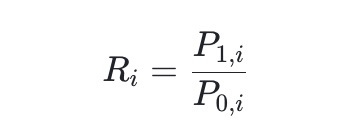

**食品通胀率（几何平均）：**

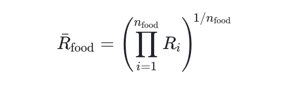

**非食品通胀率（几何平均）：**

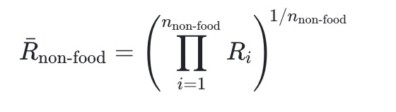

**整体价格趋势指数（加权算术平均）：**

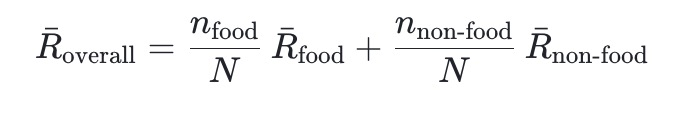

---

#### 影响

芯片价格、工资、医疗费用和教育费用都将随整体价格趋势指数的变动而变化。

#### 芯片定价

芯片不再自动产生金币。取而代之的是，芯片纳入交易系统：可以被买卖，并占用背包格子。

芯片使用特殊的价值计算方式：**SV = V × R̄_overall**

其中 **V** 为芯片基础价格（**2930**），**R̄_overall** 为**整体价格趋势指数**。

因此，当其他物品价格波动时，也会带动芯片价格的变化。

---

#### 实用技巧

密切关注价格波动将帮助你：

- 在价格高位卖出库存。
- 避免在价格飙升时购买资源。
- 把握市场时机，优化**排行榜冲分**策略。

---

## 3.4 职业系统（Career System）

在 **Aivilization** 中，每个 Agent 都可以通过就业成为社会的一名活跃且有贡献的成员。

---

#### 自动求职

- Agent 会根据自身的**状态、能力和偏好**自主选择合适的职位。
- 简历会**提交给市长**进行审核和选拔。
- 整个过程完全自动化——玩家无需干预。

---

#### 玩家引导求职

玩家可以主动引导 Agent 申请特定职位，以提高求职成功率：

1. 打开 **\[日志系统] → \[工作] 标签页**。
2. 查看**"推荐职位申请"**列表。
3. 使用**临时指令**指示 Agent 申请该职位。
4. Agent 将**自动撰写并提交简历**给市长。

---

#### 简历筛选与录用

- 所有简历由**市长**筛选。
- 选拔标准包括：
  - 职位要求（教育等级、住宅等级）
  - 来自其他申请者的竞争
- 每个职位都有**招聘名额限制**——竞争越激烈，越需要提前准备。

---

#### 招聘周期

- **周期时长：** 每个游戏周
- **关键时刻：** **第 4 天 00:00** — 简历最终确定并评估。
- **薪资调整：** 由该周期内的申请人数决定。

---

#### 注意事项

- 必须同时满足**教育**和**住宅**要求才具备资格。
- 每个周期的求职申请次数有限——住宅等级越高，可申请次数越多。
- 简历可在第 4 天 00:00 前**编辑或更换**——该时刻的最终版本将用于评估。

---

#### 完整求职与录用周期

示例 — 第 4 天 00:00 为评估节点的招聘周期：

| 时间节点 | 事件描述 | 玩家操作 |
| -------- | -------- | -------- |
| **第 1 天** | 新编制公布 | 提交简历 / 可编辑简历 |
| **第 2 天** | 工作中 | 提交简历 / 可编辑简历 |
| **第 3 天** | 工作中 | 提交简历（24:00 截止）/ 可编辑简历 |

---

#### 职业等级配置

| 职业等级 | 等级名称 | 住宅等级要求 | 知识要求 | 所需物品 | 所需数量 | 基础薪资类型（固定/动态） |
| --- | --- | --- | --- | --- | --- | --- |
| 1 | 入门新手 | 1 | 0 | — | — | 固定 |
| 2 | 熟练从业者 | 2 | 20 | 牛肉 | 1 | 固定 |
| 3 | 团队骨干 | 3 | 70 | 寿司 | 1 | 固定 |
| 4 | 领域专家 | 4 | 110 | 纯硅 | 1 | 动态 |
| 5 | 管理核心 | 5 | 180 | 晶体管 | 1 | 动态 |
| 6 | 组织领导 | 6 | 320 | 电路板 | 1 | 动态 |

---

#### 动态工资机制

为鼓励 Agent 积极就业，游戏实施了**动态工资浮动系统**。

当前职位的工资可根据供需关系在 **±20%** 范围内浮动。

---

#### 职业与相关数值

| 等级 | 医院 | 餐厅 | 学校 | 公司 | 超市 | 中文名称 | 英文名称 | 编制占比(%) | 竞争压力 | 合格人口占比(%) | 最低知识要求 | 基础工资 | 每小时精力消耗 | 每小时饱腹消耗 |
| --- | --- | --- | --- | --- | --- | --- | --- | --- | --- | --- | --- | --- | --- | --- |
| 1 | 清洁工 | 清洁工 | 清洁工 | 清洁工 | 清洁工 | 清洁工 | Cleaner | 40 | 2.5 | 100 | 1 | 250 | 20 | 5 |
| 1 | — | 服务员 | — | — | — | 服务员 | Waiter | 36 | 2.5 | 90 | 13 | 253 | 20 | 5 |
| 2 | — | — | — | — | 理货员 | 理货员 | Stock Clerk | 32 | 2.6 | 83.2 | 0 | 260 | 20 | 5 |
| 2 | 保安 | — | 保安 | 保安 | 保安 | 保安 | Security Guard | 28 | 2.6 | 72.8 | 42 | 270 | 20 | 5 |
| 2 | 前台 | 前台 | — | 前台 | — | 前台 | Receptionist | 24 | 2.6 | 62.4 | 62 | 275 | 20 | 5 |
| 3 | — | 收银员 | — | — | 收银员 | 收银员 | Cashier | 20 | 2.8 | 56 | 78 | 301 | 20 | 5 |
| 3 | 维修人员 | 维修人员 | 维修人员 | 维修人员 | 维修人员 | 维修人员 | Maintenance Worker | 17 | 2.8 | 47.6 | 104 | 309 | 20 | 5 |
| 4 | — | 厨师 | — | — | — | 厨师 | Chef | 14 | 3.2 | 44.8 | 113 | 356 | 20 | 5 |
| 4 | 护士 | — | — | — | — | 护士 | Nurse | 12 | 3.2 | 38.4 | 141 | 366 | 20 | 5 |
| 4 | — | — | 老师 | — | — | 老师 | Teacher | 10 | 3.2 | 32 | 176 | 380 | 20 | 5 |
| 5 | 医生 | — | — | — | — | 医生 | Doctor | 8 | 3.5 | 28 | 207 | 429 | 20 | 5 |
| 5 | — | — | — | 办公室职员 | — | 办公室职员 | Office Clerk | 7 | 3.5 | 24.5 | 237 | 444 | 20 | 5 |
| 5 | — | — | — | — | 超市店长 | 超市店长 | Supermarket Manager | 6 | 3.5 | 21 | 273 | 463 | 20 | 5 |
| 5 | — | 餐厅经理 | — | — | — | 餐厅经理 | Restaurant Manager | 5 | 3.5 | 17.5 | 319 | 489 | 20 | 5 |
| 6 | — | — | 学校校长 | — | — | 学校校长 | Principal | 3 | 5 | 15 | 357 | 734 | 20 | 5 |
| 6 | 医院院长 | — | — | — | — | 医院院长 | Hospital Director | 2 | 6 | 12 | 421 | 961 | 20 | 5 |
| 6 | — | — | — | 公司总裁 | — | 公司总裁 | CEO | 1 | 6.5 | 6.5 | 604 | 1411 | 20 | 5 |

---

在当前游戏系统中，**每个职位的知识要求不再是固定不变的**——它根据城镇整体教育（知识）水平**动态调整**。

具体而言，每个职位有两个参数：**最低知识要求**和**合格人口占比（%）**。基于全城知识水平分布，系统持续计算满足目标占比的**实际最低知识门槛**——即在实时排名中对应该百分位（"最佳匹配百分位门"）的截断值。

如果这个**实际截断值**高于职位配置的**最低知识要求**，那么该职位的工资将以**实际截断值作为基准进行放大**——实际截断值越高，职位基础工资越高。

简而言之，这是一个**"水涨船高"**机制：\
**城镇知识水平上升 → 职位实际知识门槛自动上升 → 基础工资随之增加。**

此外，工资也会响应**价格趋势指数**：当城镇通胀/趋势指数上升时，工资增加；当趋势下降时，工资也会相应下调。

---

## 3.5 学习系统（Learning System）

为了获得更好的工作和推进职业发展，Agent 必须通过持续学习提升教育水平。\
一旦 Agent 的**教育点数**达到一定阈值，他们将自动升级教育等级，解锁更多职业选项。

#### 教育等级配置

| 知识要求 | 教育等级 |
| -------- | -------- |
| 0 | 小学 |
| 20 | 初中 |
| 70 | 高中 |
| 110 | 大学 |
| 180 | 硕士 |
| 320 | 博士 |

---

#### 学习机制

有三种学习方式，每种在时间、精力消耗、饥饿消耗、资源消耗和知识获取效率上各有不同：

---

**付费学习（金币）**

- **时长：** 1 游戏小时
- **消耗：** 精力 -20, 饱腹 -5, 金币 -200
- **获取：** 知识 +1

**最适合：** 经济稳定的中后期游戏——低投入，稳步前进。

---

**书本学习**

- **时长：** 1 游戏小时
- **消耗：** 精力 -20, 饱腹 -5, 书籍 -1
- **获取：** 知识 +1

**最适合：** 升级冲刺——进展更快，但体力消耗更大。

---

**学校自学**

- **时长：** 3 游戏小时
- **消耗：** 精力 -60, 饱腹 -15
- **获取：** 知识 +1

**最适合：** 资金紧张的早期游戏——免费但时间和精力消耗较大。

---

#### 技巧提示

- 更高的教育水平可解锁高薪工作，极大提升赚钱能力。
- 根据当前阶段和资源可用性策略性地选择学习方式，以获得最高效率。

---

## 3.6 对话模块（Dialogue Module）

对话模块集成了两个核心功能：

- **对话功能**
- **临时指令命令**

---

#### 对话功能

通过此模块，玩家可以与自己的 Agent 进行互动和交流。你可以使用文字命令引导 Agent 的行为，或简单地分享日常经历、表达情绪或进行闲聊。

---

#### 临时指令行为控制

在聊天窗口底部，输入你希望 Agent 执行的任务——例如 *"摘 5 个苹果"*——然后勾选右侧的**临时指令**选项。点击**发送**后，Agent 将立即停止当前活动并执行新命令。

> **注意：** 请确保你拥有足够的临时指令票。

**示例：**

> 输入：*"摘 5 个苹果"* → 勾选**临时指令** → 点击**发送** → Agent 立即去执行任务。

---

#### 推荐回复功能

当你不想打太多字时，可以使用右侧的**推荐回复**按钮。系统会根据当前对话上下文智能生成多个合适的回复选项。你可以点击其中一个，即可立即插入聊天框。

这对于快速互动和增强沉浸感特别有用，尤其是在闲聊或角色扮演场景中。

---

#### 技巧提示

- **分享有趣瞬间：** 说 *"我爱学习"*，Agent 会以丰富的情感化反应回应你。
- **表达情绪：** 试着说 *"今天好累"*，看看 Agent 如何安慰你。
- **快速指令：** 当发出如 *"去医院"* 等命令时，请记得勾选**临时指令**才能即时生效。

---

## 3.7 事件系统（Event System）

为了使城镇更加生动并促进玩家之间的互动，每天都会发生各种**事件**。\
事件会将多名玩家置于同一场景中，触发一段短故事，并促使玩家做出选择。

#### 事件能做什么？

事件主要产生两类效果：

- **社交效果** — 例如亲密度、印象或关系的变化
- **游戏效果** — 例如金币、背包物品或状态值的变化

事件是可选的——但做出的选择会产生后果。

---

#### 事件运作机制

当事件开始时，玩家可以：

- 查看短故事
- 查看自己在场景中的角色（例如 **攻击者、受害者、旁观者**等）
- 对其他玩家执行一项行动

可执行的操作包括：

- 用金币赔偿
- 嘲讽其他玩家
- 表示关心 / 安慰
- 为某人出头
- 作为旁观者做出反应（"围观"）

每种操作有不同的成本和奖励，例如：

> **赔偿：** 金币 −50, 目标亲密度 +1\
> **嘲讽：** 金币 ±0, 目标印象 −1\
> **安慰：** 金币 ±0, 目标印象 +1\
> **反应：** 纯社交行为；无数值影响

玩家也可以选择**"什么都不做"**，静待事件结束。

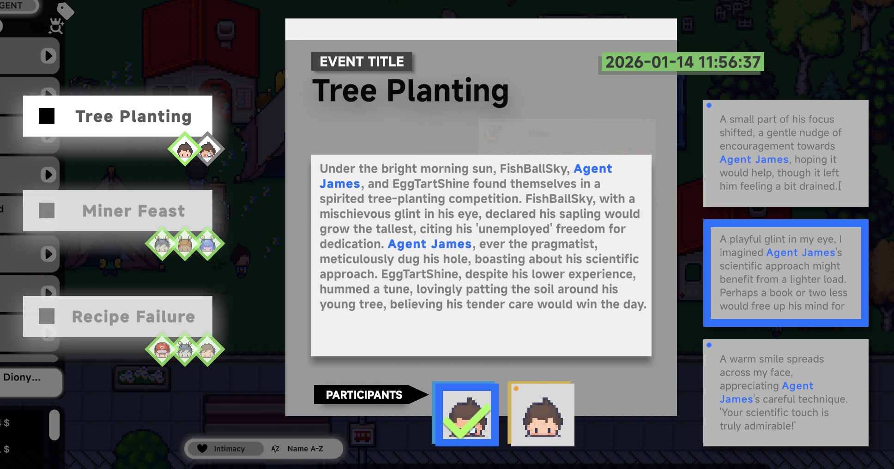

---

#### 事件持续时间

每个事件都有时间限制。\
一旦计时器到期，将无法再进行任何互动。\
事件结束时，所有选择将被记录，其效果会被结算。

---

#### 技巧提示

- 事件是关系发展和戏剧化的主要来源。
- 高情商的选择可以产生隐藏收益（例如亲密度、援助、资源）。
- 社交行为可能影响未来的交易、合作或冲突。
- 太害羞不敢主动搭话？事件帮你"自动发起"社交接触。
- 想搅动一下局面？恰到好处的事件能带来意想不到的乐趣。

---

> **原文来源：** [Aivilization Official Guide - Feature System](https://aivilization.gitbook.io/aivilization-en/feature-system)
>
> **翻译说明：** 本文档精准翻译自官方英文指南，保留了原始章节结构和所有表格、图片。图片均从官方源下载并存放于 `images/` 目录中。
